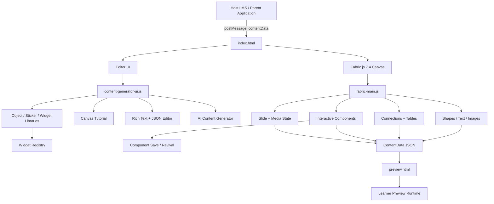

# Content_Editor# Fabric.js Content Editor

A browser-based visual content authoring application built with **Fabric.js 7.4.0** for creating rich, interactive, slide-based learning content.

The editor provides a PowerPoint-style canvas experience with editable text, images, shapes, connectors, reusable components, media, interactive learning elements, content preview, JSON editing, and LMS-oriented content workflows.

> Repository: https://github.com/Code-with-Kush/Content_Editor

---

## Overview

**Fabric.js Content Editor** is designed as a visual content-generation workspace that can be embedded into a larger LMS application.

The application is implemented as a static HTML/CSS/JavaScript editor and uses Fabric.js as the primary canvas engine. Content remains editable on the canvas and can be serialized into structured `ContentData` JSON for storage, editing, and preview.

The repository currently contains:

- the main editor UI in `index.html`;
- a dedicated learner-style preview in `preview.html`;
- the main Fabric canvas controller;
- reusable interactive component modules;
- object, sticker, and widget libraries;
- rich-text and JSON editing tools;
- slide media management;
- image optimization and cropping;
- an intelligent/AI-assisted content-generation interface;
- tutorial and keyboard-shortcut support.

---

## Key Features

### Canvas Editing

- Fabric.js-powered interactive canvas
- Object selection, move, resize, rotate, and edit
- Undo and redo history
- Clear canvas
- Canvas background controls
- Multi-object editing
- Custom Fabric controls
- Object alignment and positioning tools
- Keyboard shortcuts
- Selection recovery and quick-action controls

### Text Editing

- One-click editable text insertion
- Font family and font-size controls
- Bold, italic, underline, and alignment support
- Text colour and formatting
- Native Fabric text editing
- Rich text / textbox component
- Highlight and marker-style text support
- Paste sanitisation to prevent unwanted external formatting
- Emoji insertion
- Shared editor/preview font runtime

### Images

- Local image upload
- JPG, JPEG, PNG, BMP, GIF, and WebP support
- Image resizing
- Interactive crop workflow
- Image optimisation before placement
- Configurable maximum width and height
- Adjustable compression quality
- WebP, JPEG, and PNG output
- Before/after size and dimension preview
- Image masking and image-related widget extension points

### Shapes and Diagrams

The editor includes a searchable shape library with support for common visual content such as:

- Rectangle
- Rounded rectangle
- Circle
- Ellipse
- Triangle
- Polygon
- Diamond
- Pentagon
- Octagon
- Star
- Callout
- Arrows
- Chevron
- Flowchart-style shapes
- Custom polygon sides

Diagram-related functionality includes:

- Straight connectors
- Smart connectors
- Elbow connectors
- Curved connectors
- Arrow connectors
- Connected nodes
- Tree nodes
- Tree diagrams
- Flowchart-oriented structures

### Interactive Components

Current editor modules include reusable interactive content patterns such as:

- Flip Card
- Tree Nodes
- Stickers
- Saved Object Library
- Rich Text components
- Table widgets
- Connector components

The widget registry also provides an extensible foundation for additional interactive learning widgets, assessments, diagrams, drawing tools, gamification, and animations.

> Some entries in the widget registry are extension definitions and may require a matching runtime/factory implementation before they are available as fully functional editor components.

### Media

#### Audio

- Slide-level audio upload
- MP3 and WAV support
- Audio preview
- Remove/replace audio
- Playback controls
- Seek control in preview
- Optional "play only on first load" behaviour
- Audio optimisation workflow

#### Video

- YouTube links
- Vimeo links
- iframe embed input
- Validation and preview before attaching video to a slide

### Slide-Based Content

- Slide-oriented authoring workflow
- Slide navigation
- Per-slide content and media
- Preview page counter
- Previous/Next navigation
- Slide-level media state
- ContentData-based persistence

### Preview Runtime

`preview.html` provides a learner-style rendering shell for authored content.

It includes:

- responsive content stage;
- slide navigation;
- page counter;
- embedded media handling;
- audio playback;
- description/detail overlays;
- progressive loading feedback;
- shared font styling with the editor.

### ContentData JSON Editor

A full-screen JSON workspace is included for advanced users and developers.

Features include:

- complete `ContentData` inspection;
- editable JSON;
- JSON validation;
- formatting;
- copy action;
- search;
- next/previous search result navigation;
- line/column information;
- apply-to-content workflow.

### Intelligent Content Generation

The editor contains an AI-assisted content-generation interface intended to work with the current canvas.

The UI supports:

- generating or replacing slide content;
- preserving existing layout;
- applying updates to matching layouts across slides;
- replacing individual detected objects;
- optional source files;
- image and document attachments;
- layout selection;
- replace-current-page or append behaviour.

Supported source-file UI includes:

- PDF
- Word
- PowerPoint
- Markdown
- Text
- JPG
- PNG
- WebP

The actual AI service/API implementation can be connected to the surrounding LMS or application backend.

### Reusable Libraries

The project includes modular UI for:

- Object Library
- Sticker Library
- Widget Library
- File Dropzone

These modules allow the editor to evolve without putting all editor behaviour into one UI component.

### Built-In Tutorial

The Canvas Tutorial module provides a guided learning experience for users who are unfamiliar with the editor.

It is designed to explain:

- toolbar actions;
- canvas controls;
- editing tools;
- object operations;
- content insertion workflows;
- keyboard commands.

---

## Technology Stack

| Technology                  | Purpose                                      |
| --------------------------- | -------------------------------------------- |
| **Fabric.js 7.4.0**         | Canvas rendering and object manipulation     |
| **JavaScript**              | Main editor logic                            |
| **HTML5**                   | Editor and preview shell                     |
| **CSS3**                    | Application styling                          |
| **Bootstrap 5.3.8**         | Layout, modals, dropdowns, and UI components |
| **jQuery 3.6.0**            | Existing DOM/event utilities                 |
| **jQuery UI 1.13.2**        | Supporting UI behaviour                      |
| **Summernote 0.8.18**       | Rich-text authoring support                  |
| **jQuery MiniColors 2.3.6** | Colour selection                             |
| **Font Awesome 4.7**        | Editor icons                                 |
| **FileSaver.js**            | Client-side file saving                      |
| **canvas-toBlob**           | Canvas export support                        |

The project currently runs directly in the browser and does not require an npm compilation step for the editor shell.

---

## Application Architecture



---

## Repository Structure

```text
Content_Editor/
│
├── index.html
├── preview.html
├── README.md
├── LICENSE
│
├── css/
│   ├── Fonts.css
│   ├── Minicolor.css
│   ├── custom_layout.css
│   ├── content-generator-modern.css
│   ├── content-generator-bootstrap-overrides.css
│   ├── canvas-tutorial.css
│   ├── file-dropzone.css
│   ├── font-family-preview.css
│   ├── group-editor-preview.css
│   ├── library-islands.css
│   ├── object-library.css
│   ├── quick-action-dropdown.css
│   ├── slide-island.css
│   ├── sticker-library.css
│   ├── widget-library.css
│   └── vendor/
│
├── images/
│
└── js/
    ├── fabric.js
    ├── fabric-v7-compat.js
    ├── fabric-main.js
    ├── content-generator-ui.js
    ├── CustomControl.js
    ├── canvas-tutorial.js
    ├── connections-component.js
    ├── table-widget.js
    ├── rich-text-component.js
    ├── intelligent-content-generator.js
    ├── json-data-editor.js
    ├── tree-nodes-component.js
    ├── text-highlight-pattern.js
    ├── text-shortcuts.js
    ├── font-runtime.js
    ├── input-security.js
    ├── component-save-bridge.js
    ├── component-revival.js
    ├── FileSaver.min.js
    ├── canvas-toBlob.js
    │
    ├── components/
    │   ├── file-dropzone.js
    │   ├── object-library.js
    │   ├── sticker-library.js
    │   └── widget-library.js
    │
    └── widgets/
        └── registry.js
```

---

## Core Modules

### `index.html`

The main application shell.

It contains:

- editor toolbar;
- Fabric canvas workspace;
- object editing panels;
- component menus;
- media tools;
- slide controls;
- modal editors;
- image optimisation UI;
- AI content-generation UI;
- JSON editor;
- script/module bootstrap.

### `js/fabric-main.js`

The primary Fabric canvas controller and main editor runtime.

Responsibilities include the central canvas behaviour and integration between Fabric objects and the rest of the authoring interface.

### `js/content-generator-ui.js`

Handles modern editor UI behaviour and object-specific editor interactions.

### `js/widgets/registry.js`

Provides a declarative registry for LMS-oriented widgets.

The registry groups widgets into:

- Content
- Media
- Shapes
- Interactive Learning
- Assessment
- Diagram
- Drawing
- Gamification
- Animation

New widgets can be registered without rewriting the complete widget panel.

### `js/connections-component.js`

Contains connector/relationship functionality used for connected visual elements and diagram-style content.

### `js/table-widget.js`

Provides table-oriented canvas functionality.

### `js/tree-nodes-component.js`

Implements editable tree-node visual components.

### `js/component-save-bridge.js`

Supports serialization of reusable/custom editor components.

### `js/component-revival.js`

Restores serialized custom components back into interactive Fabric objects.

### `js/intelligent-content-generator.js`

Controls the intelligent content-generation workflow and its interaction with current canvas content.

### `js/json-data-editor.js`

Handles the full-screen `ContentData` JSON editing experience.

### `js/canvas-tutorial.js`

Provides guided editor help and interactive tutorial functionality.

### `preview.html`

Standalone preview shell for rendering stored slide data using the learner-facing content runtime.

---

## Getting Started

### 1. Clone the repository

```bash
git clone https://github.com/Code-with-Kush/Content_Editor.git
cd Content_Editor
```

### 2. Run a local HTTP server

Because the application uses multiple JavaScript, CSS, font, and media resources, run it through a local web server rather than opening `index.html` directly with `file://`.

For example:

```bash
python -m http.server 5500
```

Then open:

```text
http://localhost:5500/index.html
```

You can also use:

- VS Code Live Server
- IIS / IIS Express
- nginx
- Apache
- any static web server

---

## LMS Integration

The editor is designed to work inside a larger application.

`index.html` listens for content from its parent frame using `window.postMessage`.

Example host-side integration:

```javascript
const editorFrame = document.getElementById("contentEditorFrame")

editorFrame.contentWindow.postMessage(
  {
    contentData: JSON.stringify(existingContent),
  },
  "*",
)
```

For production use, replace `"*"` with the expected application origin and validate incoming message origins.

The received content is placed into the editor's imported-content state and can then be restored into the canvas workflow.

---

## Content Data

The application uses serialized content data to persist editor state.

A typical persistence pipeline is:

```text
Fabric Objects
     ↓
Custom Component Serialization
     ↓
Slide Data
     ↓
ContentData JSON
     ↓
Database / LMS
     ↓
Preview Runtime
```

When adding custom Fabric properties or new component types, make sure the property is supported by both:

1. serialization; and
2. revival/deserialization.

This prevents custom component data from being lost after save/reload.

---

## Adding a New Widget

The widget system is registry-driven.

A simplified widget definition can be added through the registry:

```javascript
LMSWidgetRegistry.register({
  name: "My Widget",
  category: "interactive",
  icon: "fa-puzzle-piece",
  interactionType: "click",
  create: "my-widget",
  defaultProps: {
    width: 300,
    height: 180,
  },
  keywords: ["custom", "interactive"],
})
```

A complete widget normally requires:

1. a registry definition;
2. a Fabric object/component factory;
3. an editor/properties UI if configurable;
4. serialization support;
5. revival support;
6. preview/runtime behaviour where interaction is required.

---

## Creating a Custom Fabric Component

Recommended component lifecycle:

```text
Create
  ↓
Configure
  ↓
Add to Fabric Canvas
  ↓
Edit
  ↓
Serialize
  ↓
Save
  ↓
Revive
  ↓
Preview
```

Keep custom component metadata explicit.

Example:

```javascript
const object = new fabric.Rect({
  left: 100,
  top: 100,
  width: 250,
  height: 120,
  fill: "#ffffff",
  stroke: "#1f2937",
})

object.componentType = "example-component"
object.componentVersion = 1

canvas.add(object)
```

When extending serialization, include custom properties deliberately instead of depending on implicit Fabric state.

---

## Preview Integration Note

`preview.html` currently references:

```text
../Content/main.js
```

That runtime belongs to the surrounding content/LMS environment.

Therefore, the editor itself can be served directly from this repository, but the complete standalone learner preview requires the expected parent project structure or a compatible replacement runtime.

---

## Security Notes

The repository includes an `input-security.js` module and content sanitisation-related behaviour.

When integrating the editor into a production LMS, also enforce security on the server.

Recommended controls include:

- validate `postMessage` origins;
- sanitise user-authored HTML;
- validate iframe/video URLs;
- restrict supported upload file types;
- enforce upload size limits;
- validate SVG content before rendering;
- avoid directly executing user-provided scripts;
- apply Content Security Policy where practical;
- validate all persisted `ContentData` before rendering it to learners.

Client-side validation should not be treated as the only security boundary.

---

## Development Guidelines

When adding new editor functionality:

- keep Fabric behaviour separate from UI concerns where practical;
- place reusable functionality in dedicated modules;
- preserve existing `ContentData` compatibility;
- avoid breaking stored older components;
- use versioned component metadata when object schemas change;
- update both editor and preview behaviour;
- preserve keyboard accessibility;
- retain `aria-*` attributes for interactive controls;
- keep large components out of `index.html` where they can be modularised;
- test save → reload → revive → preview for every new component.

---

## Browser Compatibility

The application targets modern desktop browsers with current HTML5 Canvas support.

Recommended:

- Google Chrome
- Microsoft Edge
- Firefox
- Safari

Because the application is a visual authoring tool with drag, resize, modal, rich-text, media, and canvas interactions, desktop browsers provide the intended editing experience.

---

## Known Integration Considerations

- The editor currently contains large JavaScript/CSS runtime files.
- Some third-party libraries are loaded from CDNs.
- `preview.html` depends on an external LMS preview runtime.
- Registry entries do not automatically mean a matching Fabric implementation already exists.
- Host applications should use strict origin validation for iframe communication.
- Changes to custom Fabric object schemas should remain backwards compatible with previously stored `ContentData`.

---

## Suggested Future Improvements

Potential architectural improvements as the editor grows:

- split the main Fabric controller into feature-specific modules;
- introduce a formal component interface/factory contract;
- add automated serialization/revival tests;
- add unit tests for widget factories;
- add end-to-end tests for author → save → reopen → preview;
- introduce a versioned `ContentData` schema;
- document the LMS host communication contract;
- centralise configuration and feature flags;
- move third-party dependencies to a managed package/build pipeline if appropriate;
- add automated accessibility checks;
- add CI validation for JavaScript and stored-content compatibility.

---

## Contributing

When contributing:

1. create a feature branch;
2. keep changes focused;
3. test the editor in a browser;
4. verify existing saved content can still load;
5. verify custom components survive serialization and revival;
6. test learner preview behaviour;
7. submit a pull request with a clear description.

Example:

```bash
git checkout -b feature/my-editor-improvement
git add .
git commit -m "Add editor improvement"
git push origin feature/my-editor-improvement
```

---

## License

This repository is released into the **public domain under The Unlicense**.

You may copy, modify, publish, use, compile, sell, or distribute the software for commercial or non-commercial purposes, subject to the terms in the repository's `LICENSE` file.

---

## Repository

**GitHub:**  
https://github.com/Code-with-Kush/Content_Editor

---

## Maintainer

Maintained by **Code-with-Kush**.
